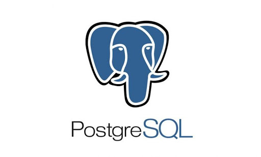

Terdapat banyak sekali varian mesin *database relational* yang saat ini ada untuk menyimpan item data. 
Mesin *open source* yang sangat populer saat ini digunakan untuk menyimpan data beberapa contohnya adalah *PostgreSQL* dan *MySQL*.

 

## Instalasi Mesin Database di Mac OS
### Pre-Requisite
Untuk mempermudah instalasi mesin Database pada Mac, instalasi dimulai dengan menginstall Homebrew.  
[Homebrew](https://brew.sh/) merupakan sebuah *package manager* di MacOS. Cara menginstall nya : 
1. Buka Terminal 
2. Ketik `/bin/bash -c "$(curl -fsSL https://raw.githubusercontent.com/Homebrew/install/master/install.sh)"
` pada terminal dan jalankan.
3. Ketik `brew doctor` dan jalankan untuk memeriksa apakah terdapat kesalahan instalasi 
4. Ketik `brew update` dan jalankan untuk mengupdate Hombrew ke versi paling baru.  

### PostgreSQL  

1. Ketik `brew install postgres` pada terminal dan jalankan untuk memulai instalasi PostgreSQL.
2. Ketik `ln -sfv /usr/local/opt/postgresql/*.plist ~/Library/LaunchAgents` dan jalankan untuk mendapatkan posisi LaunchAgent dari PostgreSQL. 
3. Copy output dari command nomor 2 kedalam clipboard  *contoh outputnya seperti `/usr/local/opt/postgresql/homebrew.mxcl.postgresql.plist`
4. Buat 2 alias untuk menyalakan/mematikan server postgres dengan cara menambahkan hasil output pada command sebelumnya pada syntax :
 `alias pg_start="launchctl load /usr/local/opt/postgresql/homebrew.mxcl.postgresql.plist"`  
`alias pg_stop="launchctl unload /usr/local/opt/postgresql/homebrew.mxcl.postgresql.plist"`
5. Setelah itu, untuk menyalakan server postgres hanya cukup dengan menggunakan command `pg_start`.
6. Buat database dengan ketik `createdb <namauser>`
6. Untuk cek semua instalasi sudah ter-install dengan baik, ketik `psql` pada terminal dan idealnya akan menghasilkan output seperti berikut:  

 
7. Ketik `\q` untuk keluar dari postgres dan `pg_stop` untuk mematikan server postgres.

### MySQL  

1. Ketik `brew install mysql` pada terminal dan jalankan.
2. Setelah instalasi selesai, terdapat 2 cara untuk menjalankan service MySQL :  
    1. `brew services start mysql`
    2. `mysql.server start` 
3. Untuk cek semua instalasi sudah ter-install dengan baik, ketik dan jalankan `mysql -uroot` pada terminal dan idealnya akan menghasilkan output seperti berikut:  

 
4. Ketik `\q` untuk keluar dari MySQL command line. 

## Instalasi Mesin Database di Windows

* Mac  

* Windows  

