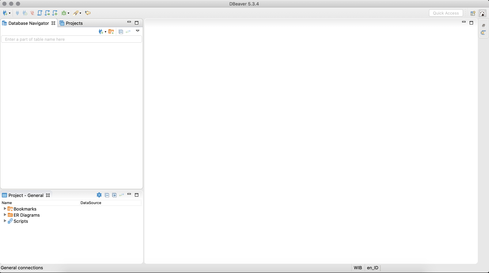

Untuk tutorial ini, query editor yang akan kita gunakan
adalah **DBeaver**. Sebuah open source IDE yang cukup *user friendly* dan
dan *compatible* untuk menghubungkannya ke database yang telah dijelaskan sebelumnya
yaitu PostgreSQL atau MySQL. 

Semua pre-requisite dan langkah-langkah untuk instalasi softwarenya sudah tersedia pada halaman github .
Saat masuk ke halaman , pilihlah untuk versi *Community Edition* dan yang sesuai dengan *Operating System* 
yang kamu gunakan.

Setelah selesai dan sukses melakukan instalasi Dbeaver, jalankan aplikasi Dbeaver untuk memulai setup koneksi database 
yang telah kita buat pada tutorial sebelumnya.

 

